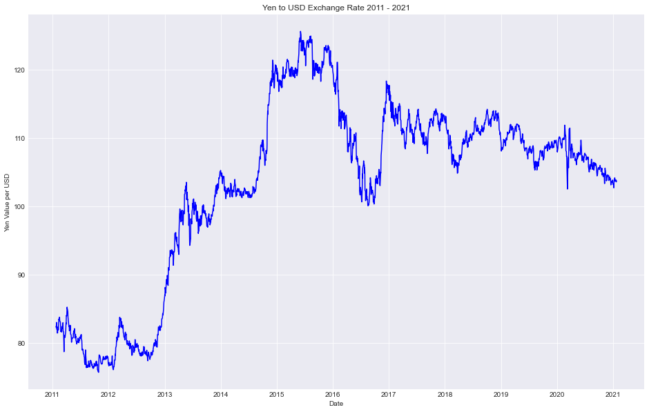
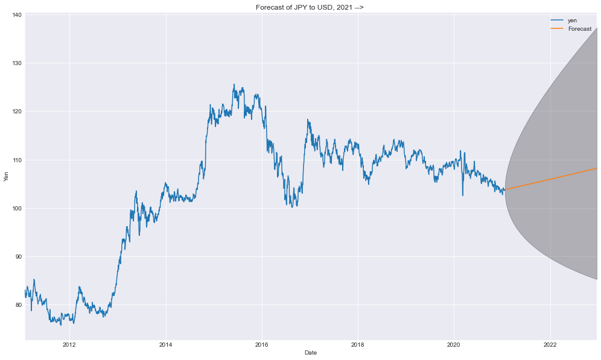

# Japanese Yen (JPY) to Dollar (USD) Exchange Rate Forecast

## Summary
The Japanese yen is the third most exchanged currency in the international foreign exchange market, only behind the US dollar and the Euro (EUR). After the coronavirus pandemic forced many companies to allow teleworking, many people considered relocating and moving. These people, including myself, were trying to make the best out of a bad situation. I have always wanted to live in Japan so in order to maximize my funds prior to moving, I created a model to predict the future exchange rates of the yen and dollar.

## Problem Statement
This problem is one of the oldest in the books: "How do I make more money?" There are always businesspeople, investors, and your everday average people who are looking to read the market, whether that be the stock or foreign exchange market. Being able to accurately predict the direction a stock or currency will move can give investors an edge over others. Using the last 10 years of exchange rate data, I trained a model to answer the question, __When should I exchange USD for yen?__

## Data Sources
Time series data from the last 10 years of JPY <--> USD was downloaded from the Federal Reserve Bank of St. Louis (https://fred.stlousfed.org/series/DEXJPUS).
Source: Federal Reserve Bank of St. Louis (https://fred.stlouisfed.org/series/DEXJPUS).

## Libraries
### General
1. Pandas
2. Numpy
3. Matplotlib

### Statistical
1. Statsmodels
2. Scikit-learn

## Results

The model was unable to forecast the results reliably. It predicted a large range of values that only increased as time went on. The forecast "curve" was a straight line that did not resemble the shape of the average currency exchange plot.